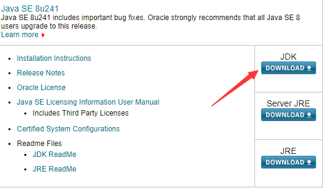

# React Native

## 开发环境搭建

### 平台要求

- Windows  ---> android
- macOS ---> android or ios

### 安装依赖

- 安装 Node, Python2.x

- 安装 JDK

  - 官网：http://www.oracle.com/technetwork/Java/javase/downloads/index.html
  - 

  

